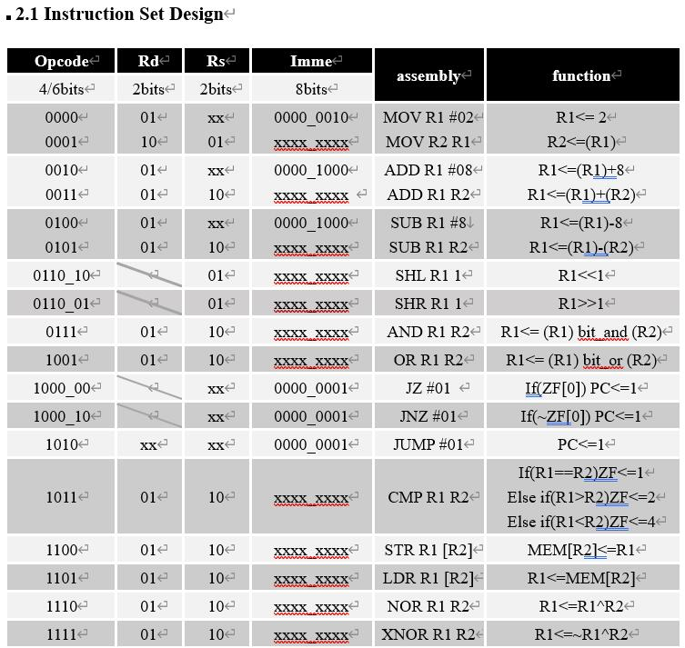
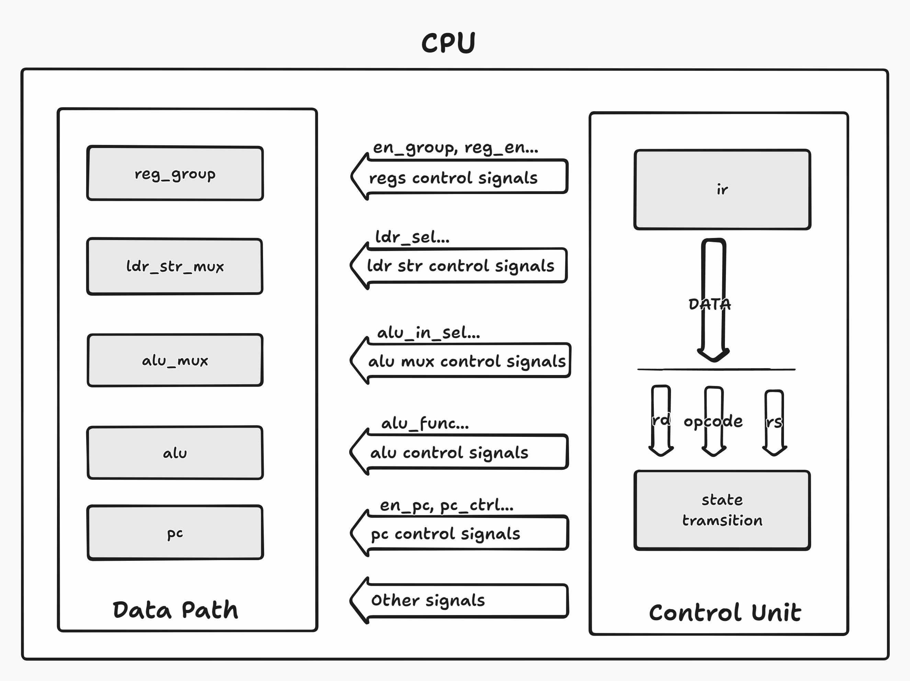
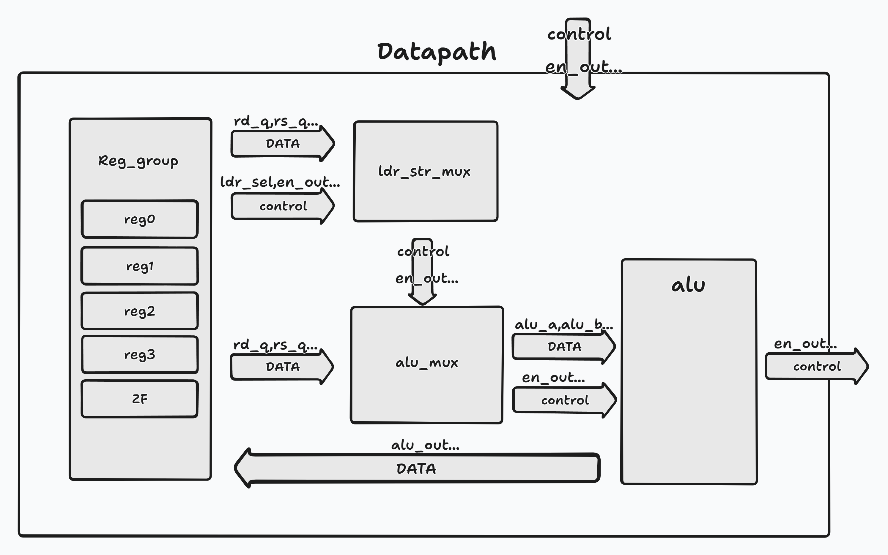
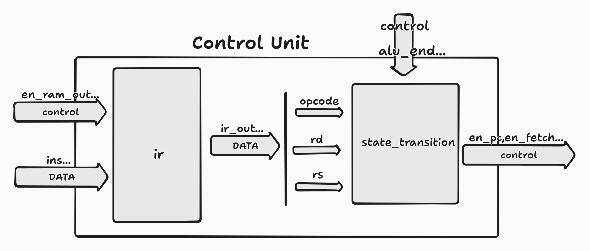

# 数电

## 内容

代码功能图和结构图请下拉到最底部！！！

此代码是LAB5的top_cpu的代码，但是没有展示ila，到时候自己看ppt去

## 声明
代码包括了所有需要的功能，***只是一个为了完成所有实验附加的代码，没有任何专业性可言！！！***

## 初衷

  众所周知，数电很可能是一坨shi，你的分数和你的实验没有半毛钱关系，不要浪费时间在这个实验上面，去学点别的技术吧。
  
\<ps\>最后你会发现你得到了一个玄学的分数，期末和平时成绩都是，最重要的是还拉不开分数，此处省略一百句骂格院的话.

  如果你真的喜欢数电，喜欢硬件描述型语言，建议你去网上找别的项目去练习一下，提示例如：USTC。而不是花时间在这个*sabi*实验上。

    

  
## 提示 
## 请珍惜你的五一假期
